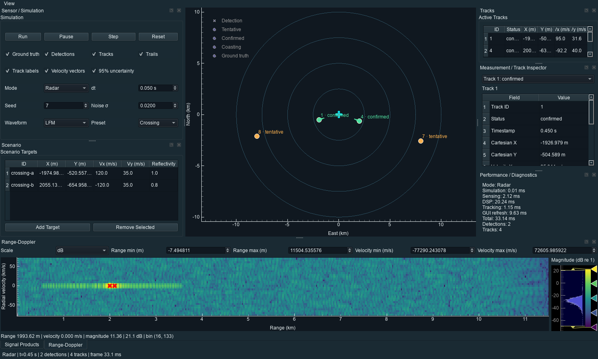

# Echorin v1.3

Echorin is a real-time 2D Radar and Sonar simulation application that keeps
ground truth separate from sensing. Moving point targets produce delayed,
attenuated, noisy array echoes; the application applies matched filtering,
Bartlett range-angle processing, CA-CFAR, coherent Doppler processing, and
Kalman multi-target tracking before displaying
the results in a dockable PySide6/PyQtGraph engineering workspace.




[Animated demo](screenshots/echorin-demo.gif) ·
[Tracking benchmark](benchmarks/tracking_benchmark.svg)

## Processing architecture

```text
World truth -> Radar/Sonar propagation -> composite array samples + AWGN
                                              |
                                              v
matched filter -> range/angle + Doppler products -> CA-CFAR range peaks
                                           -> Bartlett angle peaks
                                                        |
                                                        v
                                 association -> Kalman tracks -> GUI/export
```

Only sensor synthesis, optional PPI overlays, and evaluation benchmarks access
ground truth. CA-CFAR and tracking receive signal-derived measurements without
simulation target IDs.

## Features

| Capability | v1.0 baseline | v1.1 |
| --- | --- | --- |
| Radar and Sonar sensing, DSP, tracking, replay/export | Yes | Preserved |
| PPI, range profile, selected-bin Doppler spectrum | Yes | Dockable views |
| Full Range-Doppler heatmap and cell inspection | — | Yes |
| Track ID, status, velocity, covariance overlays | Partial | Yes |
| Measurement/track inspector, diagnostics, theme/layout memory | — | Yes |

v1.2 added an eight-element receiver array, signal-derived bearings, a
Range-Angle heatmap, and two-target angular-resolution validation. v1.3 adds
moving sensor platforms with rigid-body receiver mounts, stationary/constant-
velocity/constant-acceleration/coordinated-turn/waypoint motion, moving-receiver
Doppler, a platform editor and PPI path/heading overlays. Both Radar and Sonar
use the composite array path; the legacy directional API remains for compatibility.

- Constant-velocity scenarios with deterministic seeds and editable targets
- Radar and Sonar modes through one validated monostatic sensor abstraction
- Rectangular and LFM chirp waveforms, physical two-way delay, attenuation, AWGN
- FFT matched filtering, range profiles, fixed thresholds, and square-law CA-CFAR
- Coherent pulse trains, Doppler spectra, and radial-velocity estimation
- Mahalanobis-gated association and constant-velocity Kalman tracking
- Tentative, confirmed, coasting, and deleted track lifecycle with stable IDs
- Dockable PPI, sensor/scenario controls, track table, signal products,
  Range-Doppler heatmap, inspector, and performance diagnostics
- PPI detections, lifecycle-colored tracks, IDs, histories, velocity vectors,
  95% covariance ellipses, ground-truth toggle, and individual layer controls
- Full Range-Doppler heatmap with dB/linear scale, colorbar, physical axes,
  detection markers, selectable cells, adjustable limits, and 1D Doppler plot
- Detection/track inspector with available sensor measurements and covariance
- Persistent layout, dark/light theme, PPI focus mode, and processing timings
- Run, pause, step, reset, Radar/Sonar, timestep, seed, noise, waveform, and
  scenario-preset controls
- Scenario JSON save/load plus replayable detection/track JSON and CSV export
- Versioned scenario and frame JSON with receiver pose and platform trajectory;
  legacy v1 files remain readable
- Separate simulation, sensing, DSP, tracking, GUI, and total frame timings
- Automated unit/integration/release tests using pytest

## Engineering workspace

Drag panel title bars to rearrange or float them. The **View** menu shows hidden
panels, offers a temporary PPI focus view, and switches between dark and light
themes. The arrangement is restored on the next launch. In **Range-Doppler**,
choose dB or linear magnitude, edit the displayed range/velocity limits, and
hover or click a cell to inspect its coordinates and signal level. Clicking a
cell updates the selected-range 1D Doppler spectrum. Select a PPI detection or
track, a row in Active Tracks, or an entry in the inspector to see available
measurement or track values. Ground truth is an optional PPI overlay and is
never reported as a sensor measurement.

The default live timer uses the configured simulation step for Radar and at
least 400 ms for Sonar to accommodate its larger coherent acquisition. One
simulation step still advances by the configured `dt` in either mode. Live
sensor/DSP/tracking work runs one frame at a time in a worker so plot controls
and dock interaction remain responsive; manual **Step** uses the same pipeline.

## Installation

Echorin requires Python 3.12 or newer. From a clean checkout:

```bash
python -m venv .venv
# Windows: .venv\Scripts\activate
# macOS/Linux: source .venv/bin/activate
python -m pip install -e ".[dev]"
```

Run the desktop application:

```bash
echorin
# or
python main.py
```

Run validation:

```bash
python -m pytest -q
python -m ruff check .
```

Generate the deterministic benchmark and optional release captures:

```bash
python benchmarks/run_tracking_benchmark.py
python benchmarks/run_array_benchmark.py
python benchmarks/run_platform_benchmark.py
python -m pip install -e ".[release]"
python examples/capture_demo.py
```

## Documentation

- [Signal-processing and tracking theory](docs/theory.md)
- [Architecture and package boundaries](docs/architecture.md)
- [v1.1 release notes](docs/releases/v1.1.md)
- [v1.2 release notes](docs/releases/v1.2.md)
- [v1.3 release notes](docs/releases/v1.3.md)
- [Array benchmark scenarios](docs/scenarios.md)
- [Tracking benchmark results](benchmarks/tracking_results.json)

## Simulation assumptions

Echorin is an educational engineering simulator, not a high-fidelity propagation
or operational sensing system. It uses point reflectors, integer-sample delays,
a bounded simplified inverse-power amplitude law, AWGN, a far-field narrowband
array phase model, and a stop-and-hop coherent-pulse model. A linear array has
front/back ambiguity and the initial scan covers receiver-relative -90 to +90
degrees. It does not model clutter,
multipath, detailed antenna/acoustic beam patterns, ray tracing, or hardware.
