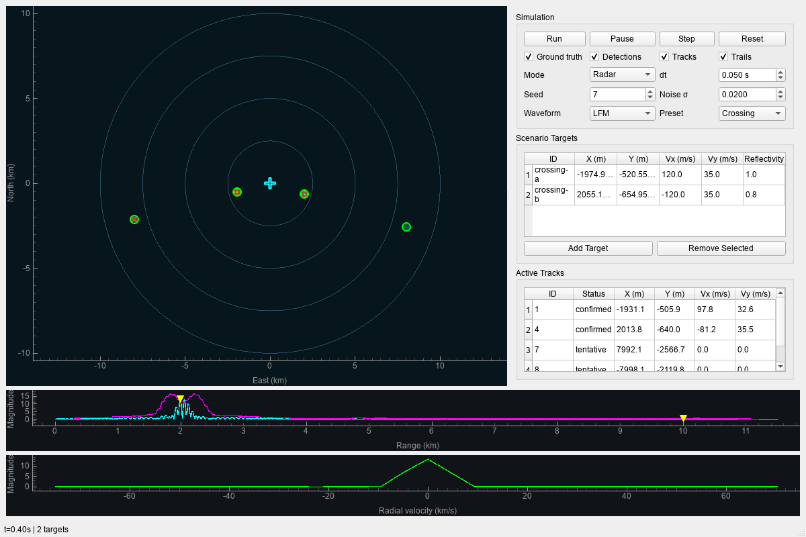

# Echorin

Echorin is a real-time 2D Radar and Sonar simulation application that keeps
ground truth separate from sensing. Moving point targets produce delayed,
attenuated, noisy echoes; the application applies matched filtering, CA-CFAR,
coherent Doppler processing, and Kalman multi-target tracking before displaying
the results in a responsive PySide6/PyQtGraph GUI.



[Animated demo](screenshots/echorin-demo.gif) ·
[Tracking benchmark](benchmarks/tracking_benchmark.svg)

## Processing architecture

```text
World truth -> Radar/Sonar propagation -> sampled echoes + AWGN
                                              |
                                              v
matched filter -> range profile -> Doppler FFT -> CA-CFAR detections
                                                        |
                                                        v
                                 association -> Kalman tracks -> GUI/export
```

Only sensor synthesis, optional PPI overlays, and evaluation benchmarks access
ground truth. CA-CFAR and tracking receive signal-derived measurements without
simulation target IDs.

## Features

- Constant-velocity scenarios with deterministic seeds and editable targets
- Radar and Sonar modes through one validated monostatic sensor abstraction
- Rectangular and LFM chirp waveforms, physical two-way delay, attenuation, AWGN
- FFT matched filtering, range profiles, fixed thresholds, and square-law CA-CFAR
- Coherent pulse trains, Doppler spectra, and radial-velocity estimation
- Mahalanobis-gated association and constant-velocity Kalman tracking
- Tentative, confirmed, coasting, and deleted track lifecycle with stable IDs
- PPI range rings, detections, tracks, trails, truth toggle, track table, range
  profile, adaptive threshold, and selected-range Doppler plot
- Run, pause, step, reset, Radar/Sonar, timestep, seed, noise, waveform, and
  scenario-preset controls
- Scenario JSON save/load plus replayable detection/track JSON and CSV export
- Separate simulation, sensing, DSP, tracking, GUI, and total frame timings
- 79 automated unit/integration/release tests using pytest

## Installation

Echorin requires Python 3.12 or newer. From a clean checkout:

```bash
python -m venv .venv
# Windows: .venv\Scripts\activate
# macOS/Linux: source .venv/bin/activate
python -m pip install -e ".[dev]"
```

Run the desktop application:

```bash
echorin
# or
python main.py
```

Run validation:

```bash
python -m pytest -q
python -m ruff check .
```

Generate the deterministic benchmark and optional release captures:

```bash
python benchmarks/run_tracking_benchmark.py
python -m pip install -e ".[release]"
python examples/capture_demo.py
```

## Documentation

- [Signal-processing and tracking theory](docs/theory.md)
- [Architecture and package boundaries](docs/architecture.md)
- [Tracking benchmark results](benchmarks/tracking_results.json)

## Simulation assumptions

Echorin is an educational engineering simulator, not a high-fidelity propagation
or operational sensing system. It uses point reflectors, integer-sample delays,
a bounded simplified inverse-power amplitude law, AWGN, idealized angular
channels, and a stop-and-hop coherent-pulse model. It does not model clutter,
multipath, detailed antenna/acoustic beam patterns, ray tracing, or hardware.
